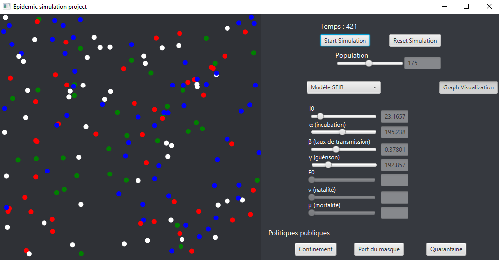
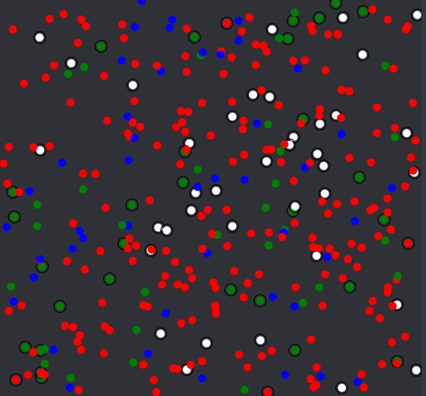
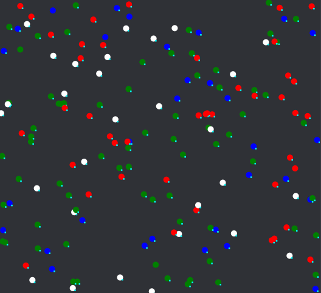
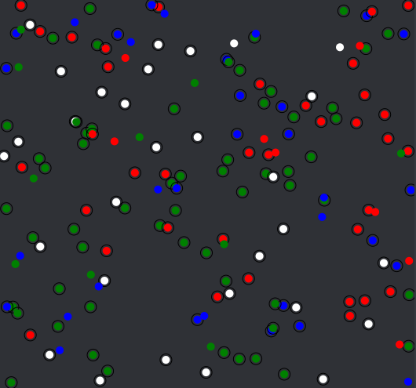
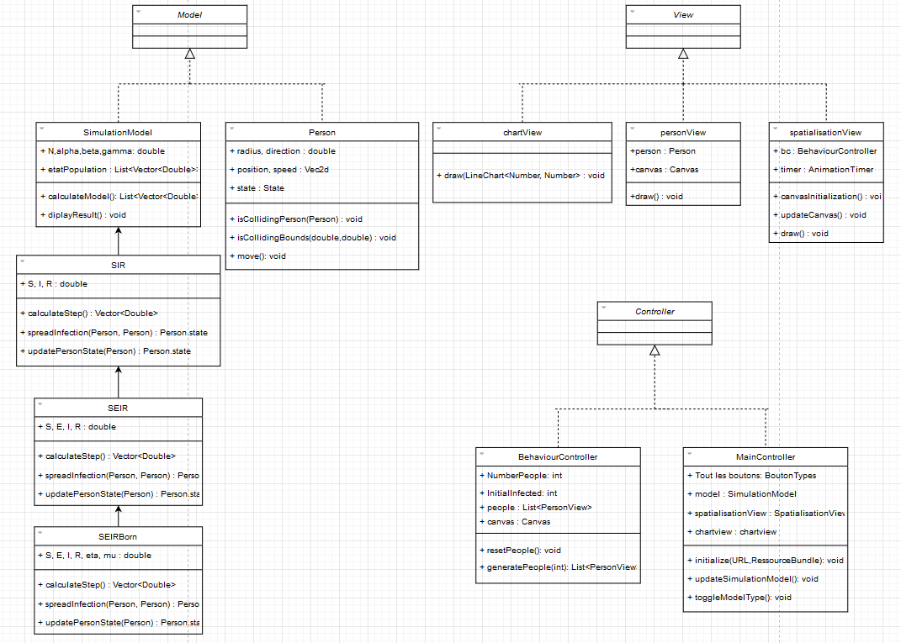
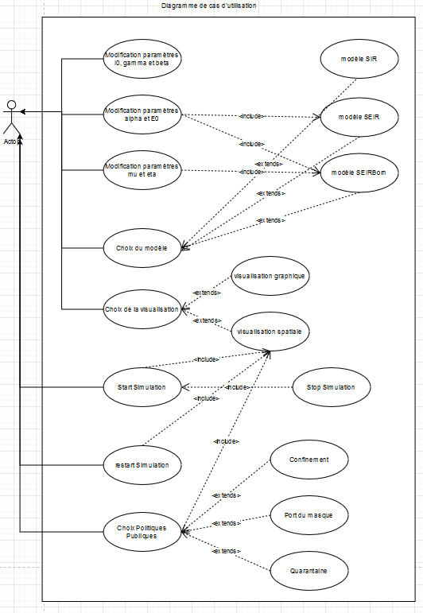

Gaëtan SCART - Yanis OULED MOUSSA

Compte rendu projet SIR - APO
# Méthodologie
Notre méthodologie a été majoritairement basée autour du choix d’une structure pratique. Puis d’adapter ce modèle à nos besoins et envies au fur et à mesure de l’avancement du projet. Nous avons commencé une première version n’ayant pas une structure suffisamment adaptée à notre besoin, nous avons donc vite changé d’avis et repris le projet sous un modèle MVC qui nous paraissait beaucoup plus propre et réutilisable. Pour l’interface nous avons choisi de découvrir une nouvelle librairie JavaFX qui nous paraissait plus intéressante et visuellement plaisante. 

C’est donc en ayant choisi un modèle MVC et d’utiliser la librairie JavaFX qui nous à guider dans la manière dont nous voulons créer ce projet. Nous avons ensuite modifié à notre guise l'apparence, les boutons et les extensions que nous voulions mettre en avant.
### Répartition des tâches
**Yanis** : Connaissant plus en APO et en informatique à mis en place la majorité de la structure du projet et des codes, notamment le schéma MVC ou le choix de l’utilisation de la librairie JavaFX.

**Gaëtan** : Beaucoup de relectures pour trouver les erreurs, mais aussi la création d’une partie du code, réorientation du projet quand il dévie du sujet de base, rédaction du CR en grande partie et des graphiques.
# L’application
## Configuration du projet
Nous avons développé le projet en utilisant l’IDE IntelliJ. Cet IDE a été particulièrement pratique, notamment pour l’import d’une librairie de développement graphique JavaFx.

La marche à suivre pour la configurée est expliquée sur le site : <https://openjfx.io/openjfx-docs/>

Notre projet est disponible à cette adresse : <https://github.com/Yaimuu/SIR_Project>
## Interface graphique
Nous avons décidé d’utiliser une interface graphique afin de réaliser ce projet. Pour cela nous avons choisi la librairie JavaFx car elle est plus récente, se rapproche plus des méthodes développement Web et est plus esthétique que les autres librairies graphiques Java.

Afin de pouvoir développer plus facilement l’application, nous avons opté pour une structure MVC.

Notre application se présente donc ainsi :

On arrive directement sur la partie graphique avec comme modèle de base, le graphe.
## Le graphe
Le graphique modélise les équations différentielles sans spatialisation et il est donc possible de jouer avec les curseurs afin de faire varier les courbes. Il est également possible de passer à un modèle différent en sélectionnant le modèle souhaité ainsi que de passer au modèle spatialisé.

Il est également possible d’exporter les données du graphe dans un fichier .csv.
## La visualisation spatiale
La visualisation avec spatialisation est assez différente de la visualisation graphique. En effet, elle présente chaque personne se déplaçant individuellement sur une carte et ne se sert pas des équations différentielles du modèle SIR. Certains paramètres sont également modifiés afin de s’ajuster au modèle.

Le temps écoulé s’affiche au-dessus des boutons pause/start et reset de la simulation. La simulation dure 2000 steps soit environ 20 secondes où 10 secondes peuvent correspondre à 1 jour.

C’est dans cette partie de l’application où les politiques publiques sont prises en compte.

- Quarantaine :

Les personnes en quarantaine ne bougent plus et ne peuvent plus être infectées mais il n’y a que 20% de la population concernée, par la quarantaine.

- Port du masque :

Le port du masque s’applique à 95% de la population. Il diminue grandement le taux d’infections.

- Confinement :

Le confinement s’applique à 80% de la population et diminue grandement le taux d’infections.

Conception

Comme nous pouvons le voir sur notre diagramme de classe, nous avons choisi de suivre un modèle MVC. Ceci nous paraissait de permettre un schéma de fonctionnement plus clair et plus facile à modifier ou améliorer au futur.

Dans la partie Modèle nous avons 5 classes. Tout d’abord Person, qui s’occupe des personnes une à une et nous permet d’avoir accès à leurs statut SEIR, leur position, leurs vitesses et autres. Ensuite un enchainement de 4 héritages ; SimulationModel, SIR, SEIR, SEIRBorn qui s’occupe de chaque différent modèle. Comme SEIR est juste le modèle SIR avec un catégorie en plus, SEIR hérite de SIR, etc. Chacune des classes SIR, SEIR et SEIRBorn contient des méthodes différentes pour calculer soit l’avancement du modèle graphique soit la manière dont le virus se propage et les personnes changent de statut dans le modèle spatial. La classe SimulationModel qui est le modèle mère permet d’appeler ces méthodes pour un calcul particulier et d’afficher les résultats, c’est la classe qui sera appelée dans les Controller.

Dans la partie Controller nous avons deux Controller : Le Behaviour Controller et le MainController. Le BehaviourController est particulier pour le modèle spatial et nous permet d’initier l'environnement spatial en générant les personnes. Le MainController va contenir tous les boutons de notre interface graphique et toutes les influences qu’ils peuvent avoir.

Finalement dans la partie View nous avons la classe ChartView qui affiche les courbes, la classe PersonView qui permet l’affichage d’une personne dans le modèle spatiale et SpatialisationView qui permet d’afficher la grille totale et le déplacement des personnes à l'intérieur.

**Description des cas d’utilisations**

- ***Choix du Modèle*** : Ce bouton déroulant nous permet de choisir entre les trois modèles de base décrit dans notre projet SIR (sains, infectés et guéris) SEIR (avec une catégorie exposée en plus) et SEIRBorn (avec de la natalité et mortalité naturelle en plus)

- ***Modification paramètres I0, gamma et beta et population*** : un bouton slider nous permet de changer les valeurs de ces paramètres, ce qui va modifier en temps réel notre graphe ou modélisation. Le paramètre I0 décrit le nombre d’infectés au début de la modélisation, gamma décrit le délai de guérison, et beta la probabilité de répandre l’infection. Population permet de modifier la quantité de personnes dans la simulation

- ***Modification paramètres alpha et EO***: cette fois-ci le paramètre alpha correspond au délai d’incubation du virus, pendant lequel le sujet à était contaminé mais ne peut pas encore contaminer d’autres personnes. Le paramètre E0 correspond à la quantité de personnes qui était en période d’incubation au début de la modélisation.

- ***Modification paramètres mu et eta*** : le paramètre mu correspond au taux de décès naturel de la population tandis que eta correspond au taux de natalité.

- ***Choix de la visualisation*** : Nous avons choisi de montrer ce modèle de deux manières différentes, un graphique contenant des courbes de l’évolution de chaque catégorie de personne et un affichage graphique représentant l’évolution des populations dans un cadre spatial. Attention les premières courbes sont là pour montrer le fonctionnement des paramètres si toutes les personnes sont dans la même pièce, elles ne prennent pas en compte la spatialisation. 

- ***Export CSV*** : permet d’exporter les données modélisées par le graphe dans un fichier CSV.

Le choix d’avoir fait un graphique délié du modèle spatial et de pouvoir mieux comprendre le fonctionnement de chaque paramètre dans des rencontres avant de rentrer dans le modèle spatial. Il est donc recommandé de regarder le graphique avant le modèle spatial.

Tous les prochains cas d’utilisation ne sont applicables que dans le modèle de spatialisation

- ***Start/stop simulation*** : Bouton qui permet de mettre en mouvement les personnes et de lancer la simulation ou de la figer.

- ***Restart Simulation*** : Bouton qui remet à zéro la simulation à partir de ces paramètres de départ

**Choix Politiques**

- ***Confinement*** : empêche une partie de la population de se déplacer
- ***Quarantaine*** : empêche toute la population de se déplacer
- ***Port du masque*** : le taux de transmissions du virus est réduit, et nos personnes portent des jolis masques !
